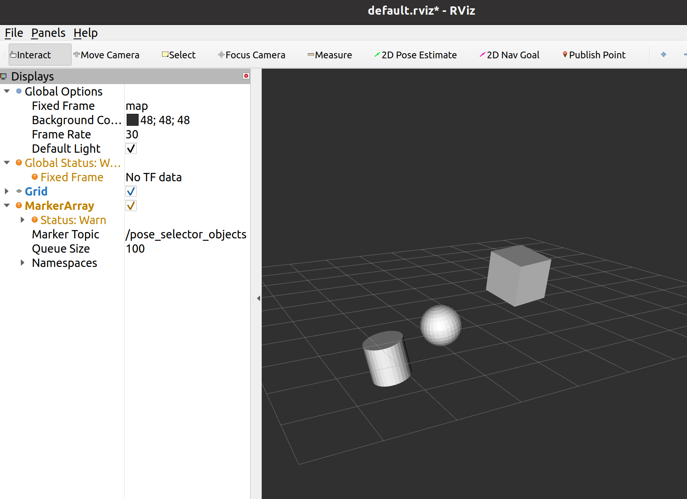

# pose_selector

This package provides functionality for storing, querying, and modifying pose information of objects in robotic simulation or real-world applications.

## Table of Contents
**[Installation](#installation)**<br>
**[Messages](#messages)**<br>
**[Services](#services)**<br>
**[Nodes](#nodes)**<br>
**[Example Usage](#example-usage)**<br>

</br>

## Installation

1. This installation tutorial relies on ssh key authentication, if you haven't uploaded ssh keys to your github account, please follow this [link](https://docs.github.com/en/free-pro-team@latest/github/authenticating-to-github/connecting-to-github-with-ssh)


2. Install ros noetic ([link](http://wiki.ros.org/noetic/Installation/Ubuntu))


3. Install python catkin tools

        sudo apt-get install python3-osrf-pycommon python3-catkin-tools

4. Create catkin_ws

        cd $HOME
        mkdir -p ros_ws/pose_selector_ws/src
        cd $HOME/ros_ws/pose_selector_ws
        source /opt/ros/noetic/setup.bash
        catkin build

5. Clone repo

        cd $HOME/ros_ws/pose_selector_ws/src
        git clone git@git.ni.dfki.de:environment_representation/pose_selector.git

6. Import dependency repositories

        vcs import < pose_selector/my.repos

7. Install dependencies

        sudo apt install python3-rosdep
        cd $HOME/ros_ws/pose_selector_ws
        rosdep update
        rosdep install -r --from-paths ./ -i -y --rosdistro noetic

8. Build workspace

        cd $HOME/ros_ws/pose_selector_ws
        source $HOME/ros_ws/pose_selector_ws/devel/setup.bash
        catkin build

</br>

## Messages

The pose_selector uses the ObjectPose and ObjectList messages from [object_pose_msgs](https://git.ni.dfki.de/environment_representation/object_pose_msgs) package.

</br>

## Services


**ClassQuery.srv**

Given a class type as a request, this service will return arrays of ObjectPoses corresponding to all instances of the requested class type.

request:

    string class_id

response:

    object_pose_msgs/ObjectPose[] poses

</br>


**ConfigSave.srv**

This service saves all current pose information as file_name.yaml in the /config directory.

request:

    string file_name

response:

    None

</br>


**PoseDelete.srv**

This service deletes a pose corresponding to the class and instance id provided in the request.

request:

    string class_id
    int64 instance_id

response:

    None

</br>

**PoseQuery.srv**

This service returns the pose information of the object associated with the requested class and instance IDs.

request:

    string class_id
    int64 instance_id

response:

    object_pose_msgs/ObjectPose pose_query_result


</br>

**PoseUpdate.srv**

This service updates the current pose information (either creating new entries or updating existing ones) with the poses in the service request.

request:

    object_pose_msgs/ObjectList poses

response:

    None

</br>

**GetPoses.srv**

This service retrieves all currently saved pose information. The response is an ObjectList containing all pose information.

request:

    None

response:

    object_pose_msgs/ObjectList poses

</br>

## Nodes


### pose_selector_node

The pose_selector_node node provides functionalities to create, update, delete, and save pose information of objects.

**Service Servers**

* **pose_selector_query** (pose_selector::PoseQuery, queries a specific class and instance)
* **pose_selector_class_query** (pose_selector::ClassQuery, queries all objects of a specific class)
* **pose_selector_update** (pose_selector::PoseUpdate, updates the pose of an object with given class/instance)
* **pose_selector_delete** (pose_selector::PoseDelete, deletes the pose of a given object class/instance)
* **pose_selector_save** (pose_selector::ConfigSave, save current poses to configuration file)
* **pose_selector_activate** (std_srvs::SetBool, (de)activate pose_selector)
* **pose_selector_get_all** (pose_selector::GetPoses, retrieves all currently saved poses)
* **pose_selector_clear** (std_srvs::Trigger, clears all current content of the pose_selector)

**Subscribers**

* **pose_sub_** (pose_selector::ObjectList, default topic: `/logical_image`)

**Launch Files**

* `pose_selector_default.launch`: launches the node with empty objects_of_interest and empty initial poses
* `pose_selector_demo.launch`: launches the node with empty objects_of_interest and demo configuration file of demonstration poses.

**Launch File Arguments**
* `config_file`: name of configuration file to be loaded. File should be located in /config folder.
* `objects_of_interest`: object classes to be saved in pose_selector. If this list is empty, all objects will be saved. If this list contains classes, any PoseUpdate call concerning a class not in objects_of_interest will be ignored.

**Configuration Files**

* `pose_selector_default.yaml`: default configuration with no debug messages (debug=false)
* `pose_selector_demo.yaml`: testing configuration file with example prior-knowledge poses to initialize the pose_selector with, and debug messages

**Configuration File Parameters**

* **debug** (bool default: false, set to true to turn on debug messages)
* **poses** (struct, setup for pose storage. See configuration files for examples)
* **poses/\<name\>/x** (double, object position on x-axis)
* **poses/\<name\>/y** (double, object position on y-axis)
* **poses/\<name\>/z** (double, object position on z-axis)
* **poses/\<name\>/rx** (double, object orientation quaternion x value)
* **poses/\<name\>/ry** (double, object orientation quaternion y value)
* **poses/\<name\>/rz** (double, object orientation quaternion z value)
* **poses/\<name\>/rw** (double, object orientation quaternion w value)
* **poses/\<name\>/size_x** (double, object size on x-axis)
* **poses/\<name\>/size_y** (double, object size on y-axis)
* **poses/\<name\>/size_z** (double, object size on z-axis)
* **poses/\<name\>/min_x** (double, object's bounding box minimum position on x-axis)
* **poses/\<name\>/min_y** (double, object's bounding box minimum position on y-axis)
* **poses/\<name\>/min_z** (double, object's bounding box minimum position on z-axis)
* **poses/\<name\>/max_x** (double, object's bounding box maximum position on x-axis)
* **poses/\<name\>/max_y** (double, object's bounding box maximum position on y-axis)
* **poses/\<name\>/max_z** (double, object's bounding box maximum position on z-axis)

</br>

### dope_converter_node

The dope_converter_node converts messages of type vision_msgs/Detection3DArray into object_pose_msgs/ObjectList type. This allows for the use of pose_selector to store poses of objects detected by an object detection/pose estimation (such as DOPE).

**Subscribers**

* **dope_sub_** (vision_msgs::Detection3DArray, default topic: `/dope_output`)

**Publishers**

* **converter_pub_** (object_pose_msgs::ObjectList, default topic: `/dope_converter_poses`)

**Launch Files**

* `dope_converter.launch`: loads the class IDs from the given configuration (i.e. same as in DOPE) and launches the converter node.

**Launch File Arguments**

* `config`: name of configuration file to be loaded. Should be the same class IDs parameters used in DOPE.

**Configuration Files**

* `dope_converter_test.yaml`: demonstration configuration for the dope converter

</br>

### pose_selector_visualizer_node

The pose_selector_visualizer_node will constantly query a pose_selector instance and publish MarkerArray messages containing the meshes of the associated objects.

**Publishers**

* **objects_mesh_publisher** (visualization_msgs::MarkerArray, default topic: `/pose_selector_objects`)

**Launch Files**

* `mesh_visualizer.launch`: launches the mesh visualizer by itself (no pose_selector instance)
* `pose_selector_with_visualizer.launch`: launches the mesh visualizer and pose_selector

**Launch File Arguments**
* `mesh_config`: name of configuration file to be loaded, contains URLs to meshes. File should be located in /config folder.

**Configuration Files**

* `example_mesh_config.yaml`: demonstration configuration for mesh config file. This configuration file corresponds to three meshes: cube, cylinder, and sphere.

**Configuration File Parameters**

* **meshes** (struct, see configuration files for examples)
* **meshes/\<name\>** (string, object class ID)
* **meshes/\<name\>/<URL\>** (string, URL location for mesh)

</br>

## Example Usage

</br>

### Pose Selector

In one terminal, launch the pose_selector_node by executing the following:

```
source devel/setup.bash
roslaunch pose_selector pose_selector_demo.launch
```

If `debug` parameter is set to `True`, then you should be presented with the current pose information obtained from loading the configuration file.

While the pose_selector_node is running, execute the following in a new terminal to activate updating of pose_selector:

```
rosservice call /pose_selector_activate "data: true"
```

Once the pose selector is activated, you may trigger update/query/delete service calls to test each functionality. (You can use tab completion when calling a service to auto-fill the service message).

For example, to query all objects of class screwdriver, execute the following:

```
rosservice call /pose_selector_class_query "class_id: 'screwdriver'"
```
You should then be presented with the pose information of all objects of class screwdriver.

</br>

### Pose Selector Visualizer

The mesh visualizer for the pose selector can be tested by executing the following:

```
roslaunch pose_selector pose_selector_with_visualizer.launch
```

Once the launch file has been executed, rviz can be used to visualize the object markers. The cylinder, sphere, and cube objects should be visible, as shown in the following image:



</br>
